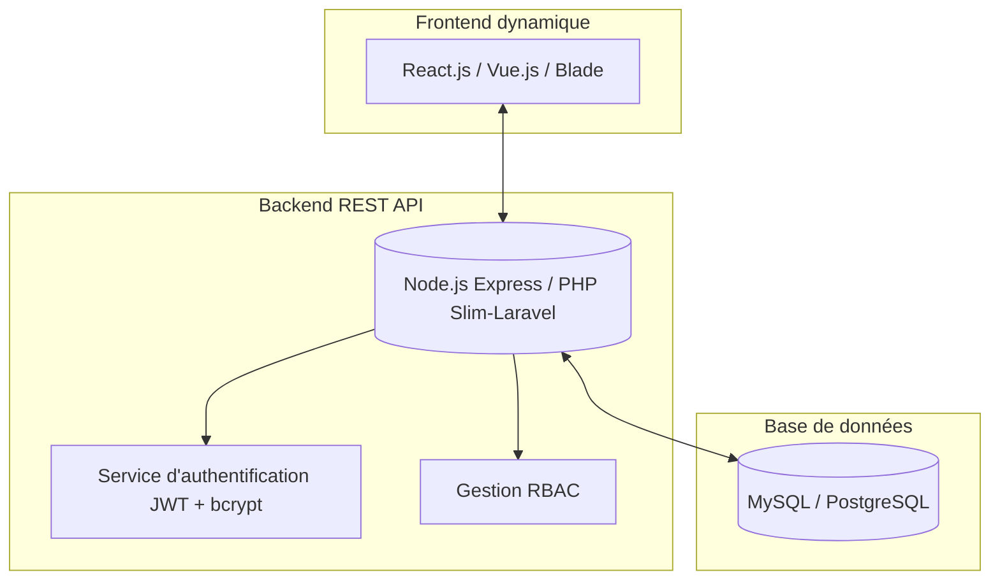

# ImpactTracker – Portail de Suivi pour ONG

## Contexte et objectif
ImpactSolidaire gère plusieurs projets humanitaires (éducation, santé, environnement) financés par des donateurs multiples. Le suivi actuel repose sur des feuilles Excel éparses entraînant des ressaisies et des erreurs. ImpactTracker vise à fournir un portail web dynamique et sécurisé qui permet :

- aux chefs de projet terrain de saisir et suivre leurs indicateurs d'avancement ;
- aux donateurs d'accéder en temps réel aux performances des projets financés ;
- à l'administrateur de gérer les projets et les utilisateurs depuis une interface centralisée.

## Mission de l'équipe technique (MOE)
L'équipe SI conçoit, développe et prépare la mise en production du portail. Les objectifs clés sont les suivants :

1. Définir l'architecture logicielle et l'infrastructure cible.
2. Produire un prototype fonctionnel reposant sur un framework moderne (Node.js/Express, PHP ou Python/Flask).
3. Garantir la sécurité, la fiabilité et l'expérience utilisateur.
4. Livrer la documentation technique et le plan de mise en production.

## Architecture applicative

### Rôle des modules
- **Frontend dynamique** : interfaces réactives, formulaires sécurisés, visualisations interactives pour les tableaux de bord.
- **Backend REST API** : logique métier (gestion des projets, indicateurs, utilisateurs), orchestrations RBAC, validations et services techniques (email, export, audit).
- **Base de données** : stockage persistant et structuré des utilisateurs, des projets, des indicateurs et des audits de sécurité.
- **Sécurité** : authentification JWT avec mots de passe hashés via bcrypt, gestion fine des rôles (admin, chef de projet, donateur), chiffrement des données sensibles et exposition via HTTPS.

## Politique de sécurité
1. Authentification sécurisée avec stockage hashé des mots de passe et tokens JWT pour les sessions.
2. Contrôle d'accès basé sur les rôles :
   - **Admin** : gestion complète des projets, indicateurs et utilisateurs.
   - **Chef de projet** : création et mise à jour des indicateurs, suivi des projets assignés.
   - **Donateur** : consultation des rapports et tableaux de bord.
3. Protection des données et flux chiffrés via HTTPS, validation des entrées et surveillance des vulnérabilités.

## Tableau de bord & KPIs
| KPI | Description | Objectif |
| --- | ----------- | -------- |
| Taux d'adoption | % de chefs de projet utilisant activement la plateforme | > 80 % |
| Satisfaction des donateurs | Note moyenne de satisfaction | > 4/5 |
| Respect du budget | Écart entre budget prévu et dépensé | < 10 % |
| Vulnérabilités critiques | Nombre d'incidents de sécurité détectés | 0 |

## Fonctionnalités dynamiques du prototype
1. Authentification multi-rôles (admin, chef de projet, donateur).
2. Gestion des projets (création, affectation, suppression) réservée aux administrateurs.
3. Saisie et mise à jour des indicateurs par les chefs de projet (ex. enfants scolarisés, puits construits, patients soignés).
4. Visualisation dynamique des rapports et statistiques pour les donateurs (graphiques, barres de progression, exports).
5. Tableau de bord administrateur offrant une vision globale des projets et alertes opérationnelles.

## Technologies recommandées
| Domaine | Technologie |
| ------- | ----------- |
| Frontend | React.js / PHP (Blade) / Bootstrap |
| Backend | Node.js (Express) / PHP |
| Base de données | MySQL ou PostgreSQL |
| Authentification | JWT / bcrypt |
| Déploiement | Docker / XAMPP |
| Sécurité | HTTPS, validation des entrées, CORS |

## Résultat attendu
Le portail ImpactTracker doit être dynamique, responsive et accessible depuis un navigateur ou un terminal mobile. Il fournit :

- une interface intuitive et localisable pour les chefs de projet ;
- un reporting automatique, interactif et visuel destiné aux donateurs ;
- une administration centralisée et évolutive pour l'équipe SI ;
- une architecture modulaire permettant un déploiement à grande échelle.

